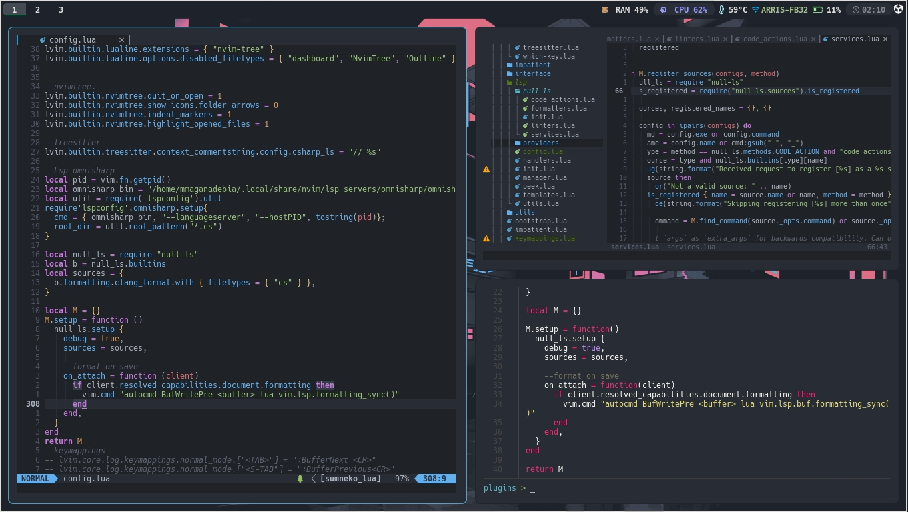
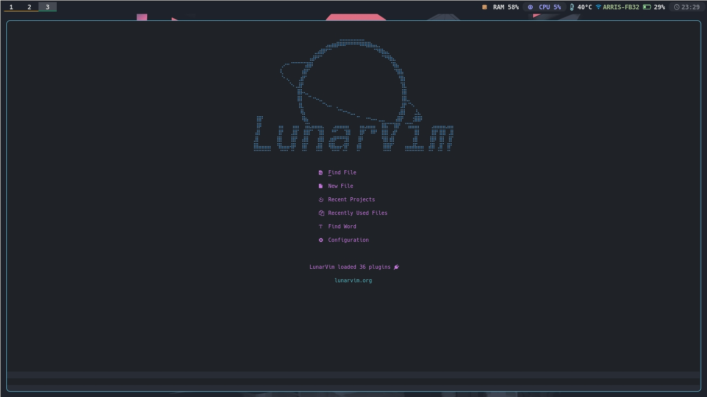
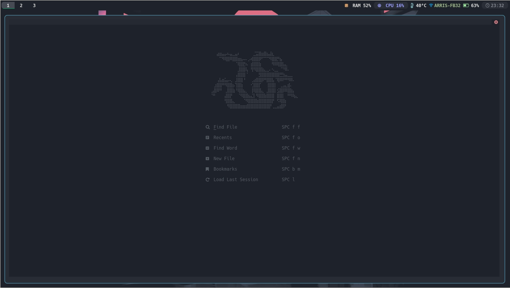
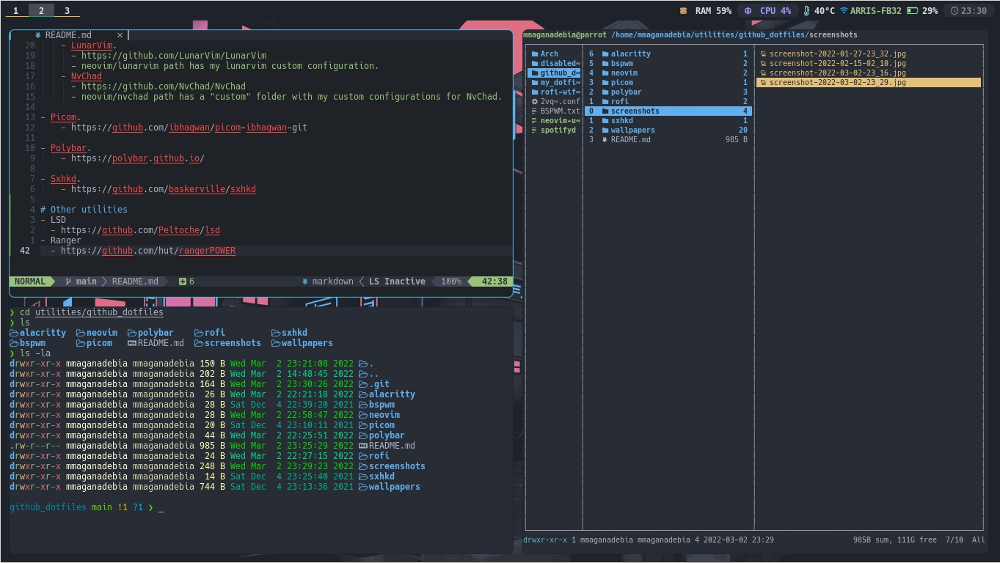

# Dotfiles
My GNU/Linux OS Configurations.

Only configuration files from my GNU/Linux instalation, no tutorial or instalation files.

To configure you OS like me, install your own toos and copy my files into your config routes.

# Screenshots

 
 
 
 

# Installed tools
- Alacritty.
    - https://github.com/alacritty/alacritty
 
-Kitty
    - https://sw.kovidgoyal.net/kitty/

- BSPWM.
    - https://github.com/baskerville/bspwm

- NEOVIM.
    - https://neovim.io/

- NEOVIM utilities pack.
    - LunarVim.
      - https://github.com/LunarVim/LunarVim 
      - neovim/lunarvim path has my lunarvim custom configuration.
    - NvChad
      - https://github.com/NvChad/NvChad
      - neovim/nvchad path has a "custom" folder with my custom configurations for NvChad.

- Picom.
    - https://github.com/ibhagwan/picom-ibhagwan-git

- Polybar.
    - https://polybar.github.io/

- Sxhkd.
    - https://github.com/baskerville/sxhkd

# Other utilities
- LSD
  - https://github.com/Peltoche/lsd
- Ranger
  - https://github.com/hut/rangerPOWER
- PowerLevel10k
  - https://github.com/romkatv/powerlevel10k
-warpd
  - https://github.com/rvaiya/warpd
-Lightdm
  -Lightdm-webkit2 with Aether.
-Rofi
-Node
-viu -> to kitty.
-rofi-wifi-menu
-spotifyd
-spotify-tui
